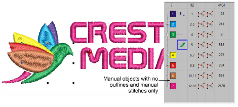

# Machine files

Different embroidery machines understand different languages. Each has its own control commands for the various machine functions. Before you can stitch a design, it must be in a format which can be interpreted by the machine. Machine or ‘stitch’ files are low-level formats for direct use by embroidery machines. They contain only stitch coordinates and machine functions. They are generally created on-the-fly when sending designs to machine. Or they are converted when saving to disk or memory stick.

## Manual objects

When they are read into EmbroideryStudio, machine files do not contain object information such as outlines or stitch types, but present the design as a collection of stitch blocks called ‘[manual objects](../../glossary/glossary)’. Manual objects are created wherever machine functions – e.g. color changes or trims – are detected in the design. They have only general and connector [properties](../../glossary/glossary#properties). Manual objects, in turn, consist of individual stitches, called ‘manual stitches’.

## Related topics...

- [Opening machine files](../../Production/convert/Opening_machine_files)
- [Using embroidery disks](../../Production/output/Using_embroidery_disks)
- [Embroidery file formats](../../Management/formats/Embroidery_file_formats)
- [Exporting designs for machine](../../Production/output/Exporting_designs_for_machine)
