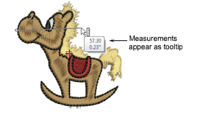
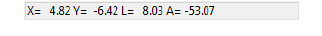

# Measure distances on screen

Measure the distance between two points on screen using the Measure command. View measurements in the Status bar or tooltip.

::: tip
For more accurate results, zoom in before you measure. The measurement is always the actual size, and is not affected by the zoom factor.
:::

## To measure a distance on screen...

1. Select View > Measure or press M and click the start point.

2. Move the pointer to the end point and hold the mouse still. If activated, length and angle measurements appear in a tooltip.

The following information displays in the Status Bar:

- Position coordinates of the end point (X=, Y=)
- Length of the measured line (L=)
- Angle of the line relative to the horizontal (A=).

Measurements are shown in millimeters or inches according to selection.

3. Press Esc again to exit the command.

## Related topics...

- [Other general options](../../Setup/settings/Other_general_options)
