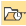
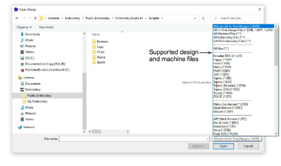
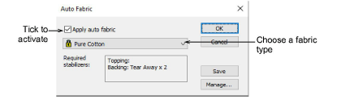
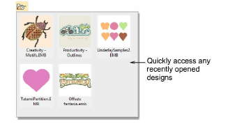

# Open designs

|                            | Use Standard > Open Design to open an existing design.                                      |
| ------------------------------------------------------ | ------------------------------------------------------------------------------------------- |
|  | Use Standard > Open Recent Designs to open a design from a list of recently opened designs. |

EmbroideryStudio opens a comprehensive range of both ‘[outline](../../glossary/glossary)’ and ‘[machine](../../glossary/glossary)’ files.

## To open a design...

- Click the Open Design icon.

- Navigate to the design folder. The dialog filter defaults to ‘Wilcom All-in-One’ designs which displays all native [EMB](../../glossary/glossary) design files. Adjust the filter as required...

| Filter                  | Files                                                                 |
| ----------------------- | --------------------------------------------------------------------- |
| All-in-one design files | All design files supported by EmbroideryStudio including JAN and ART. |
| All machine files       | Filter by machine file format only. No design files.                  |
| All embroidery files    | All supported ‘design’ and ‘machine’ files.                           |

- Select a design or designs.
- To select a range, hold down Shift then select first and last.
- To select multiple items, hold down Ctrl and click.

::: tip
For more information about a selected file, right-click and select Properties from the popup menu.
:::

- For file types other than [EMB](../../glossary/glossary) or ESD, click Options and adjust [recognition](../../glossary/glossary#recognition) options as preferred.
- Click Open.
- Optionally, select Design > Auto Fabric to apply preferred fabric settings.

- Whenever you want to work on a recently opened design, use the Open Recent Designs for quick access.

- If the Backup Copy option is active, a backup copy of the current design file is automatically created in its previously saved form. Access the backup folder via the File > Open Backup Design command.

::: tip
You can also open designs from proprietary [embroidery disks](../../glossary/glossary), or read them from paper tape.
:::

## Related topics...

- [Automatic save & backup options](../../Setup/settings/Automatic_save_backup_options)
- [Viewing design information](../view/Viewing_design_information)
- [Working with fabrics](../../Digitizing/properties/Working_with_fabrics)
- [Using embroidery disks](../../Production/output/Using_embroidery_disks)
- [Embroidery file formats](Embroidery_file_formats)
