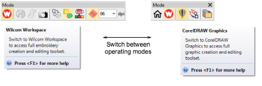

# Operating modes

|  | Double-click to start EmbroideryStudio. |
| ---------------------------------------------- | --------------------------------------- |

Open EmbroideryStudio using the desktop icon or the MS Windows® Start menu. The application has one workspace or ‘design window’ but you interact with it in different operating modes. These can be accessed via the Modes toolbar.

The main modes you’ll be accessing are:

| Mode               | Function                                                                                                                   |
| ------------------ | -------------------------------------------------------------------------------------------------------------------------- |
| Home               | With this mode you can return to the Home screen to access new designs, or access tutorials and other product information. |
| Wilcom Workspace   | This mode allows you to create and edit embroidery objects using an embroidery digitizing toolset.                         |
| CorelDRAW Graphics | This mode allows you to create and edit vector objects using the CorelDRAW® Graphics Suite toolset.                       |
| Design Library     | This mode allows you to manage designs and job orders.                                                                     |

::: warning Caution
You need to calibrate your monitor so that designs at 1:1 scale appear at real size. Do this when you first install EmbroideryStudio or whenever you change your monitor. [See Calibrating the monitor for details.](../../Setup/hardware/Calibrating_the_monitor)
:::

## Related topics...

- [Home screen](Home_screen)
- [Wilcom Workspace window](Wilcom_Workspace_window)
- [CorelDRAW Graphics window](CorelDRAW_Graphics_window)
- [Design library](Design_library)
