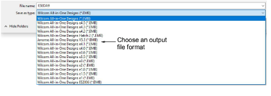
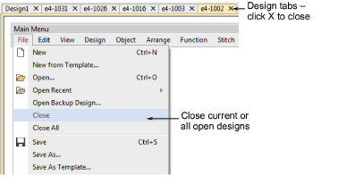
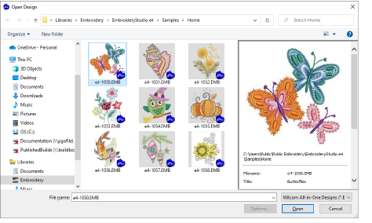

# Save & close designs

|  | Use Standard > Save Design to save the current design. Right-click to open the Save As dialog. |
| ---------------------------------------- | ---------------------------------------------------------------------------------------------- |

The Save Design option allows you to save a design to the latest native EMB ‘all-in-one’ format. To save designs to previous formats, choose File > Save As.

Native EMB files contain a complete set of design information in a single ‘all-in-one’ file – object outlines and properties, actual stitches and machine functions, thread colors, a picture icon, summary information, and more. Even the original design bitmap image can be included in EMB format. Only native EMB files provide 100% perfect scaling and transformation. EmbroideryStudio lets you save designs in various native EMB formats. This can be important if your suppliers or clients use previous versions of Wilcom software.

::: warning Caution
If a design feature is not available in the selected file type, it will be converted. For example, Flexi Split stitching may be changed to plain tatami. If the design contains a bitmap using a color depth unsupported by the selected file type, it will be removed from the resulting file.
:::

## Closing designs

To close designs, use the commands in the File menu to close open designs individually or all together. Alternatively, use the design tabs to close open designs.

## Design thumbnail display

Design thumbnails reflect display settings at the time of saving. When a design is saved, the design thumbnail is generated using all visible objects as well as the current design background. If you have bitmap or vector display turned on, these too appear in the thumbnail.

## Related topics...

- [Exporting designs for machine](../../Production/output/Exporting_designs_for_machine)
- [View embroidery components](../view/View_embroidery_components)
- [Using embroidery disks](../../Production/output/Using_embroidery_disks)
- [Machine Formats](../../Setup/machines/Machine_Formats)
