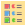
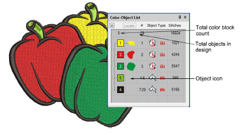
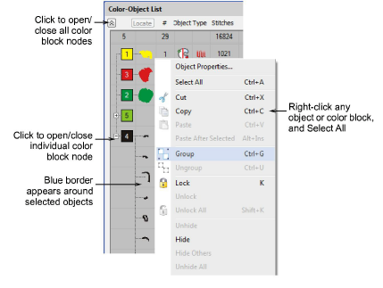

# Select objects with Color-Object List

|  | Use Docker > Color-Object List to toggle the Color-Object List on/off. Use it to view and sequence objects in a design. |
| ------------------------------------------------------------ | ----------------------------------------------------------------------------------------------------------------------- |

The Color-Object List offers an easy way to select objects and selectively view them. It is synchronized with the design window, dynamically updating whenever you edit.

## To select objects by Color-Object List...

- Click the Color-Object List icon to open the docker. A separate icon for each [color block](../../glossary/glossary) and each object in the design appears in order of stitching.

- Click a ‘node’ to open or close a color block and see its components.

- Click an icon to select a color block and/or individual objects.
- To select a range of items, hold down Shift as you click.
- To select multiple items, hold down Ctrl as you click.
- To select all items, right-click and choose Select All from the popup menu.
- To deselect, click away from the design.

Note: You can also use the Color-Object List to group and lock objects as well as cut, copy and paste, resequence, and branch objects. [See Combining Objects for details.](../../Modifying/combine/Combining_Objects)
