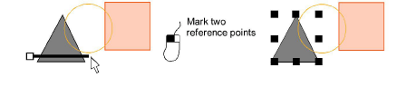

# Select objects with selection tools

|      | Use Select > Select Object to select individual objects as well as groups or ranges of objects. |
| ------------------------------------------------ | ----------------------------------------------------------------------------------------------- |
|  | Use Select > Freehand Select to select object at current by drawing a freehand line.            |
|    | Click Select > Polygon Select to select objects with a selection marquee.                       |
|  | Click Select > Polyline Select to draw a line through the object to select.                     |

Use selection tools to select individual objects as well as groups or ranges of objects.

## To select objects...

- The simplest way to select an object is to point and click with the Select Object tool activated. [Selection handles](../../glossary/glossary) appear around selected objects.

- To select multiple items, hold down Ctrl as you click. To select a range, hold down Shift as you click.
- Alternatively, drag a selection marquee around the objects you want to select.

- Where you have a mixture of objects – outline, closed-fill, open-fill – click through holes or gaps to select objects beneath.
- Alternatively, use the Freehand Select tool to draw a freeline around the object/s you want to select. Press Enter to close.

- Alternatively, use the Polygon Select tool to mark reference points around the object/s you want to select. Press Enter to close.

- Or use Polyline Select to mark two or more reference points to create a line touching all objects you want to select.

- To select an object which is sitting behind another filled object, hold down the 2 key and click until the underlying object is selected.
- To select all objects, select Edit > Select All or press Ctrl+A. [Selection handles](../../glossary/glossary) appear around the entire design.
- Deselect objects by any of the following means:
- To remove an object from a selection, hold down Ctrl and click.
- To deselect all, click an empty area of the background or a different object.
- Alternatively, press Esc or X to deselect all or select Edit > Deselect All.

Tip: EmbroideryStudio also provides a method for you to select individual objects within grouped objects. [See Select objects within groups for details.](../../Modifying/combine/Select_objects_within_groups)
