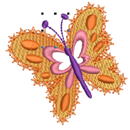

# Selecting objects

EmbroideryStudio provides various ways to select [embroidery objects](../../glossary/glossary). It supports point & click, [selection marquee](../../glossary/glossary) and multiple object selection. The Color-Object List provides an easy way to select objects and colors and access their properties.

Tip: Depending on your background, you can change display colors for unsewn stitches, selected objects, object outline, grid and guides. [See also Change display colors.](../view/Change_display_colors)

## Related topics...

- [Select objects with selection tools](Select_objects_with_selection_tools)
- [Select objects with Color-Object List](Select_objects_with_Color-Object_List)
