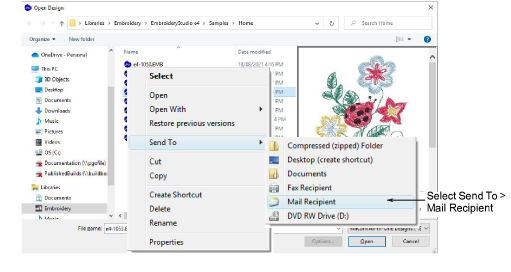

# Send designs as email attachments

|  | Use Standard > Open Design to send a design as an email attachment. |
| -------------------------------------- | ------------------------------------------------------------------- |

You can attach designs to emails from the design window or via the Open Design dialog.

## To send designs as email attachments...

- With the design open in the design window, select File > Send via Email.
- Alternatively, click the Open Design icon. Select the file to send, then right-click it. The popup menu appears. Select Send To > Mail Recipient.

Your default email system is launched and a new email created with the design file attached.

- Enter mailing details and send.
- Optionally, to output a design as a bitmap, select File > Capture Design Bitmap.

## Related topics...

- [Outputting designs as images](../../Production/reports/Outputting_designs_as_images)
