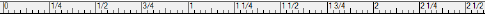
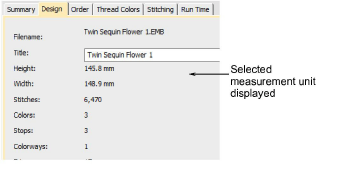

# Set measurement units

The first time you run EmbroideryStudio, the measurement system will default to whatever the operating system is using. However, you can change measurement units from within EmbroideryStudio.

Note: Technically, when you select ‘U.S.’, you will get the imperial measurement system – inches, feet, and yards. Inch rulers are displayed in 1/16, 1/8, ¼, ½, and 1" divisions. The grid size can be set in decimal inches.

## Ripple-on effects

Changing the measurement system will change the units used by most controls.

Relevant fields also appear in the selected unit of measurement – e.g. Design Information docker as well as Production Worksheet.

There are, however, exceptions to this rule:

- Stitch List: this used to be displayed in inches for U.S. systems. But these are stitch lengths, so must always be in mm.
- Stitch length and density controls remain in mm regardless of measurement system. These controls reflect the machine functions as industrial machines are always in millimeters.

## Specify measurement units on-the-fly

Alternatively, you can specify units of measurement when typing values into a measurement control. EmbroideryStudio automatically converts the value.

For example, if a US customer orders lettering in inches – say ¾" – and the digitizing is to be done in metric, you can enter ‘3/4in’ or ‘3/4 in’ into the Lettering Height field and it is automatically converted to 19.05mm.

Note: EmbroideryStudio supports both proper and improper fractions – e.g. ‘1 1/3’ as well as ‘4/3’. It does not, however, support mixed units – e.g. 1’3". Nor does it display values as fractions after they are entered, only during.

## Supported units

Supported units include:

- millimeters, mm
- inches, in
- feet, ft
- yards, yd
- centimeters, cm
- meters, m

Tip: EmbroideryStudio also allows entering units in text form, both English and the language the software is currently running in.

## Related topics...

- [Grid display options](../../Setup/settings/Grid_display_options)
- [View design details in EmbroideryStudio](../view/View_design_details_in_EmbroideryStudio)
- [Create lettering with object properties](../../Lettering/lettering_create/Create_lettering_with_object_properties)
- [Select stitches with the Stitch List](../../Modifying/functions/Select_stitches_with_the_Stitch_List)
