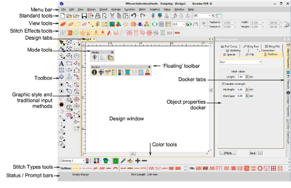
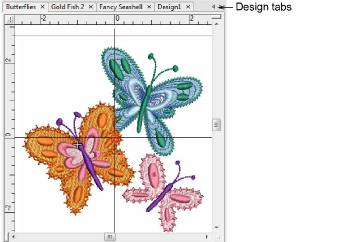
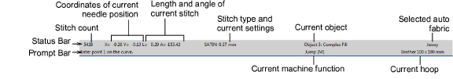

# Wilcom Workspace window

|  | Use Mode > Wilcom Workspace to digitize and edit embroidery designs. Display embroidery as well as artwork. View designs realistically in 3D simulation. |
| ------------------------------------------------ | -------------------------------------------------------------------------------------------------------------------------------------------------------- |

When you open EmbroideryStudio, it appears by default in Wilcom Workspace window with a new, blank design displayed. This mode allows you to create and edit [embroidery objects](../../glossary/glossary) using the embroidery [digitizing](../../glossary/glossary) toolset. The screen image below shows the more prominent toolbars in EmbroideryStudio. Depending on your product level, you will have access to some or all of these options.

Use this mode when you want to create embroidery from digitizing ‘[backdrops](../../glossary/glossary)’. Various types of image file can be loaded in EmbroideryStudio. Wilcom Workspace also offers a graphical representation of what the final embroidery will look like. Use TrueView™ together with a background fabric to see how your design will look when stitched out. Some of the more prominent Wilcom Workspace interface elements include:

| Element                | Description                                                                                                                                                                                                                                                 |
| ---------------------- | ----------------------------------------------------------------------------------------------------------------------------------------------------------------------------------------------------------------------------------------------------------- |
| Menu bar               | This contains the application menus such as File, Edit, View, etc.                                                                                                                                                                                          |
| Mode toolbar           | This contains tools and icons which are visible in both Wilcom Workspace and CorelDRAW Graphics.                                                                                                                                                            |
| Standard toolbar       | This contains commonly used tools and commands which are specific to and only visible in Wilcom Workspace.                                                                                                                                                  |
| View toolbar           | This contains commands for viewing embroidery designs – e.g. as design outlines, by stitches, by machine functions, as they will stitch out on the fabric – either separately or in combination.                                                            |
| Stitch Types toolbars  | This contains tools which determine the stitch types which can be applied to embroidery objects, including Satin, Tatami, Motif Fill, etc.                                                                                                                  |
| Stitch Effects toolbar | This contains tools for modifying or improving stitch quality, including applying automatic underlay to selected objects.                                                                                                                                   |
| Toolboxes              | Depending on the product model, there are up to three ‘toolboxes’ – Toolbox, Graphics Digitizing, and Traditional Digitizing. Between them, toolboxes contain all the embroidery digitizing/editing tools specific to and visible only in Wilcom Workspace. |
| Color toolbar          | This contains the embroidery color palette which is specific to and visible only in Wilcom Workspace.                                                                                                                                                       |
| Status / Prompt bars   | These contain current status information and prompts which are visible only in Wilcom Workspace. See below.                                                                                                                                                 |
| Docker                 | Wilcom Workspace includes ‘dockers’ – Object Properties, Color-Object List, Color Palette Editor, and others. These stay open as long as you need them.                                                                                                     |
| Design Window          | This contains the main work area where you create and edit embroidery objects as well as graphics objects when you switch to CorelDRAW Graphics.                                                                                                            |

- Customize the design window by showing or hiding the grid, changing the grid dimensions, as well as showing and hiding toolbars.
- Dock or ‘float’ toolbars and dockers in any configuration that suits. Toolbars are dockable left, right, top and bottom, and can be ‘floated’ anywhere in the design window.
- EmbroideryStudio allows you the choice of large or small button icons with or without text names.

## Related topics...

- [Change backgrounds](../view/Change_backgrounds)
- [Toolbar display options](../../Setup/settings/Toolbar_display_options)
- [Access object properties](Access_object_properties)
- [Display grids, rulers & guides](Display_grids_rulers_guides)
- Quick reference

## Design tabs

EmbroideryStudio allows you to switch between open designs by means of design tabs. This also makes it easy to copy/paste between designs, including drag and drop operations.

## Related topics...

- [Set up multiple views](../view/Set_up_multiple_views)
- Quick reference

## Status & Prompt bars

The Status and Prompt bars at the bottom of the Wilcom Workspace design window provides continuous display of current cursor position status as well as instructions for use of selected tools.

Information includes:

| Item           | Details                                                                                       |
| -------------- | --------------------------------------------------------------------------------------------- |
| Prompt         | Guides you through use of selected functions.                                                 |
| Stitch count   | Total number of stitches in design.                                                           |
| Design size    | Width and height.                                                                             |
| Coordinates    | Coordinates of current needle position (X/Y), and length (L) and angle (A) of current stitch. |
| Current fabric | Fabric settings take into account the type of fabric you are stitching on.                    |

## Related topics...

- [Pointer position display](../../Setup/settings/Pointer_position_display)
- [Change fabrics](../../Digitizing/properties/Change_fabrics)
