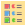
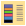
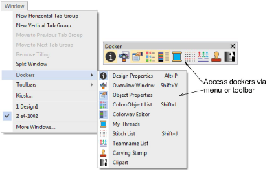
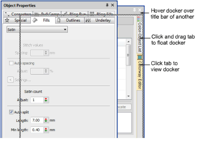
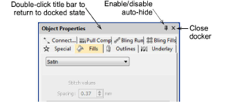

# Work with dockers

|    | Use Docker > Color-Object List to view and sequence design objects.                           |
| ---------------------------------------------------- | --------------------------------------------------------------------------------------------- |
|  | Use Docker > Object Properties to preset properties or adjust properties of selected objects. |
|      | Use Docker > Colorway Editor to assign thread colors to color palette and define colorways.   |

In Wilcom Workspace mode, there are three important [dockers](../../glossary/glossary):

| Docker            | Description                                                                                                                                                                                                         |
| ----------------- | ------------------------------------------------------------------------------------------------------------------------------------------------------------------------------------------------------------------- |
| Object Properties | The most important is the Object Properties docker. Use it together with the Property Bar to access properties of selected embroidery objects.                                                                      |
| Color-Object List | The Color-Object List offers an easy way to selectively view and resequence color blocks and objects.                                                                                                               |
| Colorway Editor   | When you create a new design, it includes a single default colorway called ‘Colorway 1’. The Colorway Editor allows you to edit default colors, add extra color slots as required, and set up additional colorways. |

Access dockers via the Docker toolbar or Window menu. They can be docked on either side of the screen.

All dockers can be fixed or minimized. Dockers may also be ‘floated’ by dragging the caption bar to the design window or double-clicking it when ‘pinned’ in place. Dockers can be ‘nested’ to increase available workspace. When nested, tabs for each docker appear down the side.

Toggle Auto Hide next to the X close button. Docking panes automatically retract when not in use. By hovering the mouse over the tab, a minimized docker will ‘fly out’, allowing you to access its functions.

## Related topics...

- [Access object properties](Access_object_properties)
- [View selected color blocks](../view/View_selected_color_blocks)
- [Colorways](../../Digitizing/colorways/Colorways)
