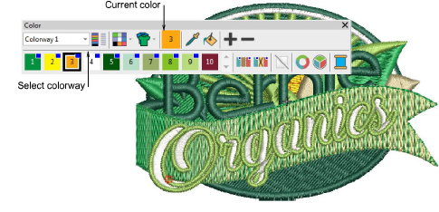
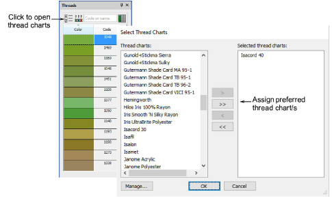
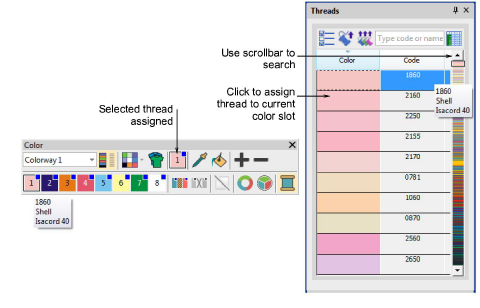

# Assign thread colors

|                        | Use Color > Threads to search for and match threads from different charts, and assign for use.                |
| -------------------------------------------------------- | ------------------------------------------------------------------------------------------------------------- |
|            | Use Color > Add Color to add a new color slot to the color palette.                                           |
|          | Use Color > Colorway Editor to assign thread colors to slots in the color palette.                            |
|  | Use Threads > Select Thread Charts to select the thread chart/s you currently have available for use.         |
|              | Use Threads > Assign Thread to assign selected thread to the highlighted color in the current colorway.       |
|                      | Use Threads > Match All to match threads from the current chart/s to all color slots in the current colorway. |

The supplied charts represent the brands of threads that EmbroideryStudio supports. Each chart includes a range of thread colors together with code, brand and description. You can search for a thread by code or description and assign it to a selected design color slot. Alternatively, let the software match design colors to threads in the current thread chart/s.

## To assign thread colors...

- Press Esc to deselect all objects. The currently selected (default) color is shown in the toolbar.

- Select a colorway and click the Threads icon. Alternatively, right-click a color in the palette. The docker opens.

- Click the Select Thread Charts button to access the thread chart listing.
- Choose the chart/s you prefer or currently have available and click OK.
- Click a color in the Color toolbar to make it current. The Threads list updates automatically.
- Alternatively, click Add Color to add a new color slot to the color palette and make it current.

- Use the scrollbar to refine your search. Or, in the Search field, enter the first few characters of the required code or name. The code is the identification number of a thread color in a brand. The system searches for the closest match and displays it in the thread color list.
- Double-click or click Assign Thread to assign a thread to the current color slot in the current colorway.
- Alternatively, use Match All to assign threads from the current chart/s to all color slots in the current colorway.
- Check the thread assignments in the Color toolbar by hovering the pointer over the slots.
- Optionally, click Remove Unused Colors to remove unused colors.

::: info Note
The Remove Unused Colors tool is disabled for machine formats that use [needle addressing](../../glossary/glossary#needle-addressing) – i.e. that have Color Change set as Needle No in the Machine Format Settings dialog.
:::
