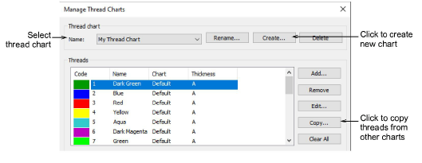
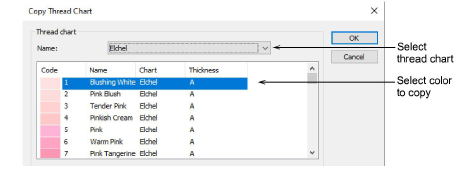

# Copy colors between charts

|  | Use Color > Colorway Editor to modify existing charts. |
| ---------------------------------------------------------- | ------------------------------------------------------ |

Copy colors between charts to create your own charts from existing threads.

## To copy colors between charts...

1Select Setup > Manage Thread Charts. Alternatively, click the Select Thread Charts button in the Colorway Editor and click Manage.

2Create a new chart or open an existing one from the Name list.

3Click Copy. The Copy Thread Chart dialog opens.

4Select the source chart from the Name list.

5Select the color/s you want to copy. Use Ctrl or Shift keys to copy a group or range of colors.

6Click OK. All colors are copied to the new chart.
