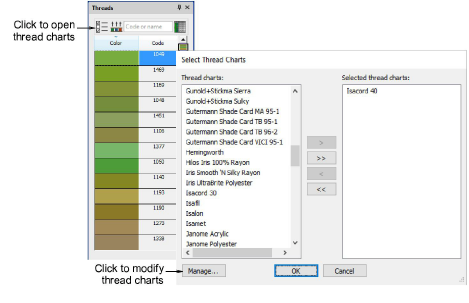
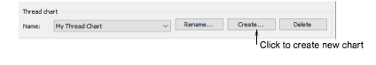
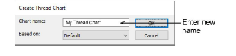
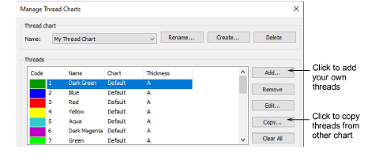
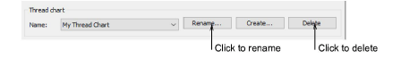
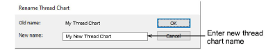

# Create & modify thread charts

|  | Use Color > Colorway Editor to create new thread charts. |
| ---------------------------------------------------------- | -------------------------------------------------------- |

EmbroideryStudio lets you define your own charts. When you create a thread chart, you are creating a store of colors for future use. Select names that will help you remember the charts or help you sort frequently-used charts to the top of the list. Rename or remove charts at any time.

## To create a new thread chart...

- Select Manage Thread Charts via the Setup menu. Alternatively, click the Select Thread Charts button in the Colorway Editor.

- Click Manage. The Manage Thread Charts dialog opens displaying the current thread chart.

- Click Create. The Create Thread Chart dialog opens.

- Enter a name for the chart and click OK. The new chart is created, ready for you to add colors.

- Click Delete to remove the entire chart.

- Click Rename to change names.

Caution: Be careful when deleting thread charts. If you delete the wrong chart you will need to reinstall EmbroideryStudio to restore it.

## Related topics...

- [Modify thread details](Modify_thread_details)
- [Copy colors between charts](Copy_colors_between_charts)
- [Definine custom thread chart files](Definine_custom_thread_chart_files)
