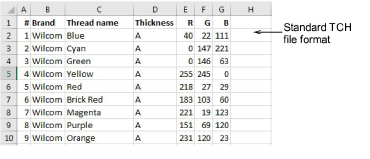

# Definine custom thread chart files

While you can define custom thread charts within EmbroideryStudio, you can also share custom charts in CSV format directly. Files need to be configured as shown...

The data that needs to be included is:

- Thread number
- Brand name
- Thread name
- Thread thickness – A, B, C, or D
- Thread RGB value.

A CSV file formatted in this way can be read directly by the software. However, you need to change the file extension to ‘TCH’ and save it to the correct custom asset location on your hard drive.

## Related topics...

- [Custom asset locations](../../Management/manage%5Fassets/Custom%5Fasset%5Flocations#XREF%5F78115%5FCustom%5Fasset)
