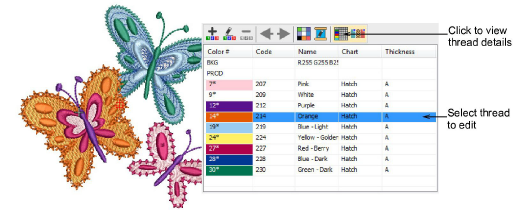
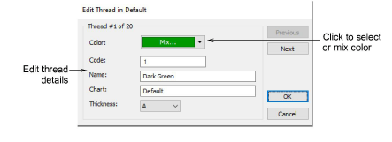

# Edit thread colors

|  | Use Color > Colorway Editor to modify threads in selected colorways.                                    |
| ---------------------------------------------------------- | ------------------------------------------------------------------------------------------------------- |
|                      | Use Colorway Editor > Edit Color to modify thread information for the currently selected palette color. |

You can always change code, name, chart, thickness or thread colors. For example, in Schiffli work, you may want to change text labels to Parts A, B and C to reflect the pattern arrangements when printing. These labels appear on the production worksheet both in the stop sequence and in Color Film printout. Alternatively, you may want to edit colors in a colorway before you assign actual threads.

## To edit thread colors...

- Open the Colorway Editor and select your colorway. If already open, the Threads docker closes automatically.

- Select the thread to edit and double-click or click Edit Color. Alternatively, double-click a palette slot in the Color toolbar.

- Edit thread details as required.

::: info Note
When a color is changed, all objects using that color update immediately, whether selected or not. All other objects in the design are unchanged.
:::

## Related topics...

- [Creating colorways](../../Digitizing/colorways/Creating_colorways)
- [Assign thread colors](Assign_thread_colors)
- [Modify thread details](Modify_thread_details)
- [Printing design reports](../../Production/reports/Printing_design_reports)
