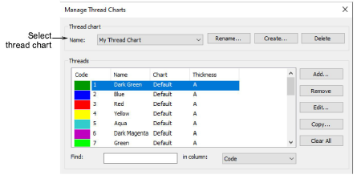
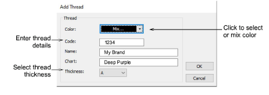

# Modify thread details

|  | Use Color > Colorway Editor to modify existing charts. |
| ---------------------------------------------------------- | ------------------------------------------------------ |

You can copy colors from other charts or mix them yourself. You can also set the code, description, brand, and thickness of existing threads. Remove obsolete thread colors for good housekeeping.

## To modify thread details...

- Select Setup > Manage Thread Charts. Alternatively, click the Select Thread Charts button in the Colorway Editor and click Manage.

- Create a new chart or open an existing one from the Name list.
- Click Add to add your own colors or Edit to change selected thread details.

- Enter code, name, and chart for the thread color.

Code is the identification number of a thread color in a brand.

- Select the appropriate thread thickness. These values are added to or subtracted from values used in the [Auto Spacing](../../glossary/glossary) table for specific stitch lengths.

| Thickness | Description                                  | Default |
| --------- | -------------------------------------------- | ------- |
| A         | Normal embroidery thread (approx. denier 40) | 0.01    |
| B         | Thicker than normal (approx. denier 30)      | 0.03    |
| C         | Finer than normal (approx. denier 80)        | \-0.03  |
| D         | Very fine (approx. denier 100)               | \-0.06  |

::: tip
Lighter weight threads do not run so well in a production environment as the machines need to be slowed down in order to avoid thread breaks. However, lighter weight threads are good for very small lettering and fine-detail designs.
:::

- Click More Colors in the droplist to see more colors or to mix your own.
- Remove threads as required:
- Click Remove to remove individual threads.
- Click Clear All to remove all threads.

## Related topics...

- [Satin auto-spacing](../../Digitizing/stitches/Satin_auto-spacing)
