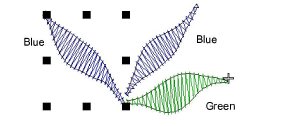
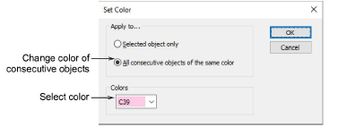
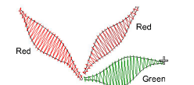

# Recoloring consecutive objects

You can change the color of consecutive objects of the same color at the same time.

## To recolor consecutive objects...

- Select the first object in the sequence to recolor.

- Select Object > Set Color. The Set Color dialog opens.

- Select the All consecutive objects of the same color option.
- Select a color from the list and click OK.

## Related topics...

- [Select objects with Color-Object List](../basics/Select_objects_with_Color-Object_List)
