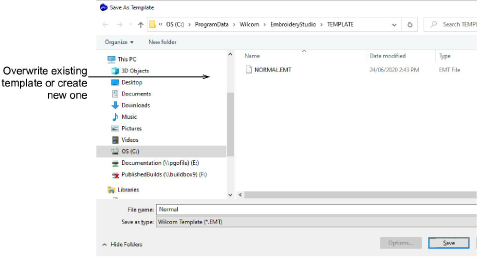

# Save default thread charts to template

You can save your default thread chart by selecting it in the Colorway Editor and saving to the NORMAL template. Alternatively you can save a dedicated template for the particular thread chart and stitch settings you are using.

## Related topics...

- [Working with templates](../../Digitizing/properties/Working_with_templates)
