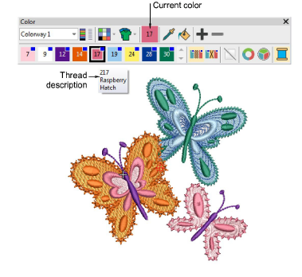
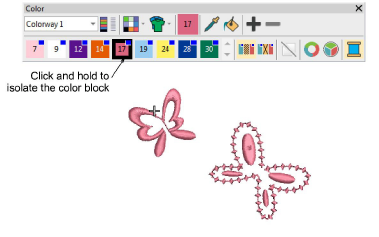
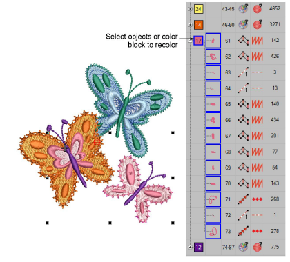
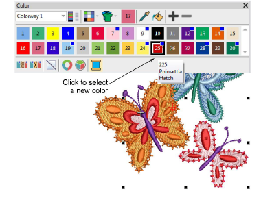

# Select thread colors

|                    | Use Color > Pick Color to pick up a color from an existing object and make it current.               |
| -------------------------------------------------------- | ---------------------------------------------------------------------------------------------------- |
|              | Use Color > Current Color to view current color.                                                     |
|    | Use Color > Apply Current Color to apply the currently selected palette color to embroidery objects. |
|                      | Use Color > Add Color to add a color to the end of the color palette.                                |
|                | Use Color > Remove Color to remove an unused color from the end of the color palette.                |
|      | Use Color > Hide Unused Colors to show or hide all unused colors in the color palette.               |
|  | Use Color > Remove Unused Colors to remove all unused colors from the color palette.                 |

New objects are digitized using the current color on the Color toolbar. You can change colors at any time.

## To select thread colors...

- Press Esc to deselect all objects.
- Click a color in the Color toolbar to make it current. Alternatively, pick a color from the design with the Pick Color tool. The current color is shown on the toolbar and highlighted in the palette with a black square.

- Hover the mouse pointer over a color to view the thread code, thread name, and thread chart in a tooltip.
- To isolate a color block in the design window, click and hold it in the Color toolbar. First press Esc to deselect all objects.

- Select object/s you want to recolor. Alternatively, select a color block in the Color-Object List.

- Select a color from the palette. Alternatively, transfer a used color to other objects with the Apply Current Color tool.

- Use the +/- buttons to add or remove color slots as needed.
- Use the Hide or Remove Unused Colors controls as preferred to compact the palette.

## Related topics...

- [Change color schemes](../../Digitizing/colorways/Change_color_schemes)
