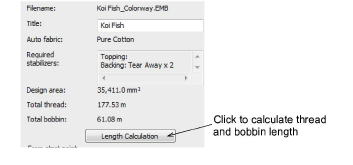
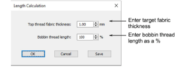

# Thread usage estimates

In order to obtain more precise thread usage estimates, you can adjust fabric thickness to suit the target fabric. This may be necessary if you are planning a large production run. Settings are generally fine-tuned on a case-by-case basis. However, adjusted settings can also be saved to the current template.

## To estimate total thread usage...

1Select Design > Design Information > Stitching tab.

2Click Length Calculation.

3Enter the thickness of the target fabric.

4Adjust the bobbin thread length according to the mixture of thread types in the design.

This factor provides a simple mechanism for a more accurate bobbin thread length estimate. The default value (100%) is suitable for a design with a mixture of stitch types. If the design is all Run stitches or all Tatami, more bobbin thread will be used and the factor can be increased say to 125%. If the design is all Satin stitch, the factor can be reduced to say 65%.

5Click OK. The Total Thread and Total Bobbin values are adjusted to take into account fabric thickness on total thread requirement.

6Optionally, click Save to save revised settings to the current template.

## Related topics...

- [Working with templates](../../Digitizing/properties/Working_with_templates)
