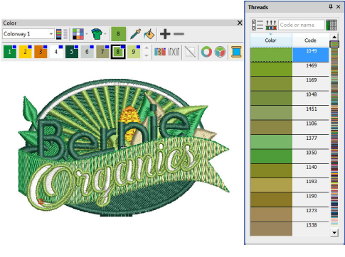

# Threads & Charts

When you digitize, you select thread colors for each object from the Color toolbar. The palette contains a selection of thread colors tailored to each design. This color scheme represents the actual threads in which the design will be stitched.

You can select colors from commercial thread charts containing a range of colors from different manufacturers. To save time when setting up new color schemes, you can create your own thread chart using your favorite or most frequently used colors. In EmbroideryStudio you can search for particular threads by criteria. Even match threads automatically from selected charts to colors in your design.

This section describes how to select colors from the Color toolbar as well as how to assign threads to the colors in your design. How to modify thread charts is also covered, as well as creating custom thread charts.

## Related topics...

- [Choosing threads](Choosing_threads)
- [Recoloring consecutive objects](Recoloring_consecutive_objects)
- [Managing thread charts](Managing_thread_charts)
