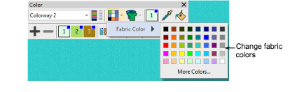

# Change backgrounds

|  | Click Color > Background & Display Colors split arrow to change the background color of the current colorway. |
| ---------------------------------------------------------------------------------- | ------------------------------------------------------------------------------------------------------------- |
|              | Use Color > Product Visualizer to choose a garment or product backdrop on which to position your decoration.  |
|                                          | Click View > Show Product to toggle product image on/off. Right-click to open the Product Visualizer docker.  |

EmbroideryStudio lets you set the background color, fabric, or product of each colorway for more realistic previews and presentations.

## To change backgrounds...

- Open the design and select a colorway.

- Use View > Show Product to toggle on or off any product image that may be included in the colorway.
- Click the droplist next to the Background & Display Colors icon.
- Change color via the Background Color popout menu.

- If your colorway includes a background fabric, change color via the Fabric Color popout menu.

- If your colorway includes an article or product, open the Product Visualizer droplist and change color via the Product Color popout menu.

Tip: Click Background & Display Colors or Product Visualizer icons to preset any of these options.

## Related topics...

- [Add colorways](../../Digitizing/colorways/Add_colorways)
- [Fabric & product backgrounds](../../Digitizing/colorways/Fabric_product_backgrounds)
