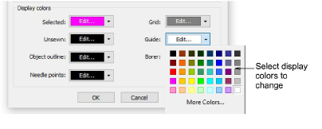
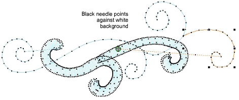

# Change display colors

|  | Use Color > Background & Display Colors (or Colorway Editor docker) to change design background presets for the current colorway. |
| ------------------------------------------------------------------ | --------------------------------------------------------------------------------------------------------------------------------- |

In addition to background color or fabric, display colors for borer holes, unsewn and selected stitches, object outlines and grid are part of the colorway definition. Change them if the default display color is not visible against the current colorway. The Background & Display Colors dialog includes a Display Colors panel.

Adjust colors as required for:

| Display item   | Description                                                                                                                                                                 |
| -------------- | --------------------------------------------------------------------------------------------------------------------------------------------------------------------------- |
| Selected       | Selected objects or stitches.                                                                                                                                               |
| Unsewn         | Unsewn stitches as they appear when traveling through the design.                                                                                                           |
| Object outline | Object outlines as they appear when Show Outlines is activated. [See View embroidery components for details.](View_embroidery_components)                                   |
| Needle points  | Change needle point display color according to current background. [See also View embroidery components.](View_embroidery_components)                                       |
| Grid           | Depending on the colorway, you may need to adjust grid display colors in order to view them against the background color. [See also Measurements.](../basics/Measurements)  |
| Guides         | Depending on the colorway, you may need to adjust guide display colors in order to view them against the background color. [See also Measurements.](../basics/Measurements) |
| Borer          | Borer points. These are machine functions which only appear when Show Functions is activated. [See View embroidery components for details.](View_embroidery_components)     |

Display colors are saved with the colorway. You can save the colorway as an EMT template file for use in future designs.

## Related topics...

- [Add colorways](../../Digitizing/colorways/Add_colorways)
- [Fabric & product backgrounds](../../Digitizing/colorways/Fabric_product_backgrounds)
- [Working with templates](../../Digitizing/properties/Working_with_templates)
