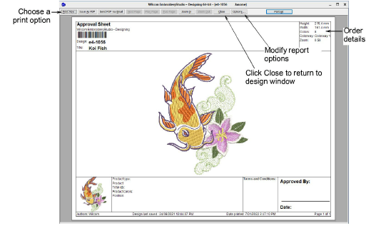

# Preview design reports

|  | Click Standard > Print Preview to preview the production worksheet on screen. |
| -------------------------------------------- | ----------------------------------------------------------------------------- |

Approval sheets and production worksheets contain all or some of the design details contained in the Design Information docker. Approval sheets are intended for customers, not production staff. Customers can see what they are ordering and approve accordingly. Production worksheets are intended for production staff. All production-related information, such as bobbin length, design size, garment fabric, etc, is provided.

## To preview a design report...

- Click the Print Preview icon.

- To change paper orientation, click Landscape or Portrait. Large designs may be displayed over a number of pages.
- To change included information and set printing/plotting preferences, click Options. Here you can choose the report type – e.g. Approval sheet.
- To print the design, choose an option:

| Option             | Function                                                                                           |
| ------------------ | -------------------------------------------------------------------------------------------------- |
| Print Now          | Send the design report to your local printer.                                                      |
| Save as PDF        | Save the report as a PDF document. You are prompted to save to the hard drive or network location. |
| Send PDF via Email | Send the report – usually an approval sheet – as a PDF attachment to your local email client.      |

- To close the preview, click Close.

## Related topics...

- [Viewing & managing design information](../../Management/manage_designs/Viewing_managing_design_information)
- [Printing design reports](../../Production/reports/Printing_design_reports)
- [Customizing design reports](../../Production/reports/Customizing_design_reports)
