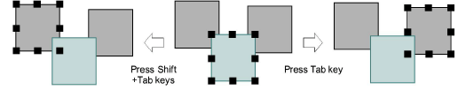

# Select objects while traveling

|  | Click Select > Select Object together with the Ctrl key to select objects as you travel through a design. |
| ------------------------------------------------------ | --------------------------------------------------------------------------------------------------------- |
|        | Left/right-click Travel > Travel by Object to travel to previous or next object.                          |
|          | Click Select > Select Current to select the object associated with the current cursor position.           |

Traveling is usually associated with checking the stitching sequence. You can select objects as you ‘travel’ through a design using the Ctrl key.

## To select objects while traveling...

- Click the Select Object icon.
- Use the Travel by Object tool or Tab and Shift+Tab buttons to travel forwards or backwards by object. [See Travel through designs for details.](Travel_through_designs)

- Click the Select Current icon or press Shift+0 to select the object associated with the current cursor position.
- Hold down the Ctrl key to select an object as you travel through it.
