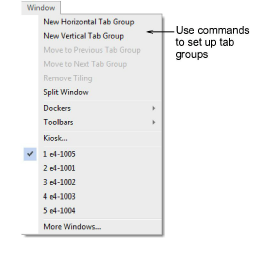
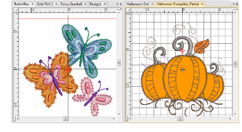
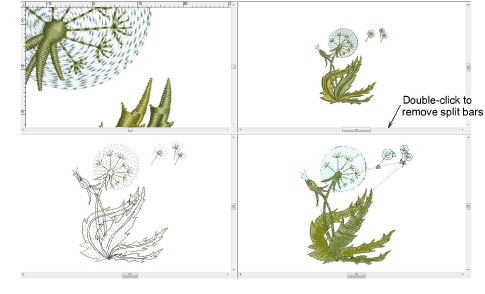

# Set up multiple views

EmbroideryStudio gives you multiple views of the same design. It also allows you to switch between open designs by means of design tabs. This also makes it easy to copy/paste between designs, including drag and drop operations.

## To set up multiple views...

- Use the Window menu commands to set up groups of tabs as preferred.

- Set up vertical or horizontal tabbed groups.

- To create multiple views of a single window, use the Window > Split Window command. Adjust view settings for each pane.

- Use the Remove Tiling command to return the design window to normal display mode.

::: tip
After certain operations you may need to refresh the screen for a clearer display. Select View > Refresh Screen or press R.
:::
