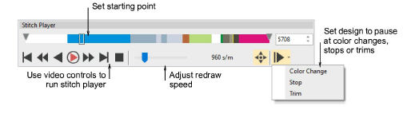
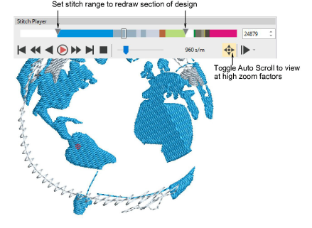

# Simulate design stitchouts

|  | Use View > Stitch Player to simulate embroidery design stitchout on screen. |
| -------------------------------------------- | --------------------------------------------------------------------------- |

Stitch Player is an important tool in EmbroideryStudio. It lets you simulate the actual embroidery design stitchout on screen. Because Stitch Player emulates the movements of the embroidery machine, you are able to make decisions about how to optimize your design in order to lessen the load on the machine. This is important if you intend to make multiple stitchouts.

## To simulate the design stitchout...

- Choose a design view to visualize your design. Stitch Player can be run with or without TrueView™.
- Click Stitch Player or press Shift+R.

- Optionally, use the slider bar to move the starting point.
- Use the controls to stitch forwards or backwards through the design. Typical ‘media player’ buttons are available for play, pause, rewind operations.
- Use the Auto Pause control to set stop points – by color change, stop, or trim.
- To redraw a section of design, specify a start and end stitch using the tabs.

- Use Auto Scroll when running Stitch Player at high zoom factors.

Tip: Depending on your background, you can change display colors for unsewn stitches, selected objects, object outline, grid and guides.

## Related topics...

- [Change display colors](Change_display_colors)
