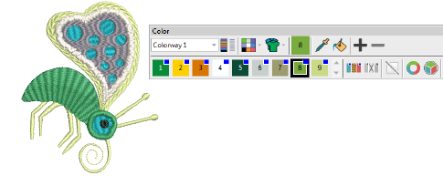
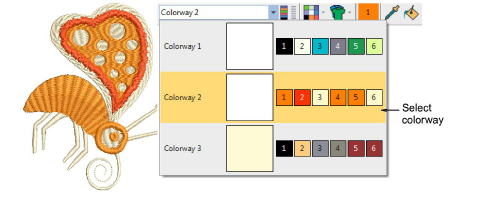
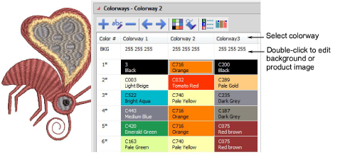

# Switch colorways

|          |                                                                                    | Use Color > Current Colorway dropdown to select a new color scheme for design. |
| ---------------------------------------------------------- | ---------------------------------------------------------------------------------- | ------------------------------------------------------------------------------ |
|  | Use Color > Colorway Editor to assign thread colors to slots in the color palette. |                                                                                |

In EmbroideryStudio, you can preview the same design in different colors on different fabrics.

## To switch colorways...

- Open a design with multiple colorways.

- Select a colorway from the droplist.

- Alternatively, use the Colorway Editor to toggle between colorways.

## Related topics...

- [Colorways](../../Digitizing/colorways/Colorways)
- [Change backgrounds](Change_backgrounds)
