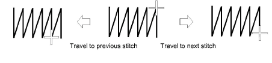

# Travel through designs

It is useful to be able to view the stitching sequence color-by-color, object-by-object, or even stitch-by-stitch. The Travel toolbar provides all tools required to do so. Travel forwards or backwards with any button by right or left mouse-clicks. Traveling can be initiated from any stitch in the design. The current needle position is marked by a white cross or ‘needle position marker’. The current stitch number is displayed in the Status Bar.

## To travel through a design...

- Turn off TrueView™ and press the Esc to ensure no object is selected.

- Travel to the start of the design by clicking the Start/End Design icon or pressing the Home key.
- Use the Travel by Stitch functions to travel forwards or backwards through the stitching sequence. Use left or right mouse-clicks or arrow keys – l or r, t or b. Alternatively, to travel by 1000 stitches, press Shift + Num+ or Shift + Num-.

- To travel by color, click/right-click Travel by Color. This is useful if you need to locate a specific color change in order to insert an object or delete it from the stitching sequence.
- To travel by object, click/right-click Travel by Object. Alternatively, press Tab or Shift+Tab.
- To travel by machine function, click/right-click the Travel by Function tool. Alternatively, press Ctrl+Page Up or Ctrl+Page Down. The needle point will stop at every [jump](../../glossary/glossary#jump), trim, and color change in the design.
- It is sometimes easier to use Travel by Trim to travel by trim functions alone – e.g. when checking for unnecessary trims. Alternatively, press Ctrl + Left Arrow or Ctrl + Right Arrow. Turn on Show Connectors and Show Functions to view while traveling.

::: tip
While traveling through a design or editing stitches, click the Select Current icon or press Shift+0 to select the object associated with the current cursor position.
:::

## Related topics...

- [View selected color blocks](View_selected_color_blocks)
- [Nest objects](../../Modifying/combine/Nest_objects)
