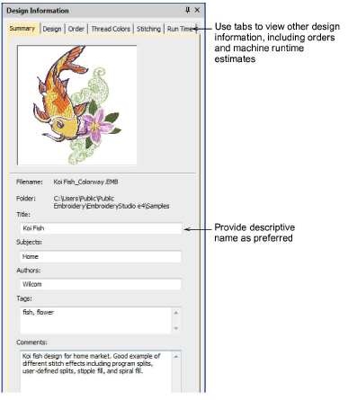

# View design details in EmbroideryStudio

|  | Use Docker > Design Information to view and modify design details prior to design approval or stitchout. |
| ---------------------------------------------------- | -------------------------------------------------------------------------------------------------------- |

You can check design details via the Design Information docker. This is always advisable prior to design approval or stitchout. The opening tab contains information about design height, width, stitch count, colors, and so on. On other tabs, summary and order information may be provided by the digitizer or sales team. The information is printed with approval sheets and production worksheets. Choose a file and select Design > Design Information.

## Related topics...

- [Viewing & managing design information](../../Management/manage_designs/Viewing_managing_design_information)
- [Managing quotes & orders](../../Management/manage_designs/Managing_quotes_orders)
