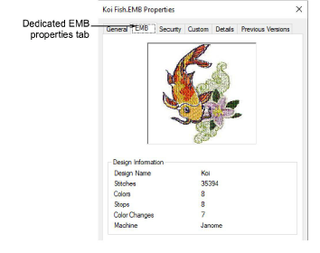
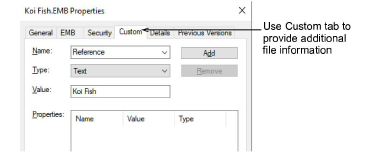

# View design details in File Explorer

Even without opening [EMB](../../glossary/glossary) files, you can check software version number and other design details via File Explorer. This same dialog can be accessed from within the Open dialog in EmbroideryStudio as well as the Design Library.

## To view design details in File Explorer...

- In File Explorer, right-click an [EMB](../../glossary/glossary) file and select Properties from the popup menu.

The Properties dialog displays with an EMB tab. View general file information, such as file size and modification dates, together with design information such as stitch count, number of [stops](../../glossary/glossary) and color changes, as well as [machine format](../../glossary/glossary#machine-format).

- The Custom tab shares information with the Design Information > Summary docker in EmbroideryStudio.

## Related topics...

- [Viewing & managing design information](../../Management/manage_designs/Viewing_managing_design_information)
