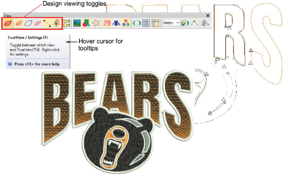
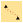

# View embroidery components

When you open an embroidery design in EmbroideryStudio, toggles on the View toolbar allow you to alternate between ‘artistic’ and ‘technical’ views. Use TrueView for presentation purposes. You can include it on approval sheets, or capture it as a bitmap to send via email or publish to a website.

Use these toggles, singly or in combination, to focus on design details. For example, view design outlines, stitches, needle points, or even machine functions such as trims and tie-offs. You can also turn on [connectors](../../glossary/glossary#connectors) in stitch view. How you use the view options will depend largely on whether you are editing a design or checking for production readiness.

::: info Note
Design thumbnails reflect display settings at the time of saving. When a design is saved, the design thumbnail is generated using all visible objects as well as the current design background. If you have bitmap or vector display turned on, these too appear in the thumbnail. [See also Save & close designs.](../basics/Save_close_designs)
:::

## Shortcut keys

Available shortcut keys include:

|                  | TrueView           | Toggle between stitch view and TrueView™.                         | T          |
| ---------------------------------------------------- | ------------------ | ------------------------------------------------------------------ | ---------- |
|          | Show Stitches      | Toggle embroidery stitching display.                               | S          |
|          | Show Outlines      | Toggle object outlines.                                            | L          |
|  | Show Needle Points | Toggle needle points to select stitches for editing.               | . (period) |
|      | Show Connectors    | Toggle connecting stitches to help position entry and exit points. | V+C        |
|        | Show Functions     | Toggle display of machine functions such as trims and tie-offs.    | V+F        |

::: tip
Depending on the design background, you can change display colors for selected objects, unsewn stitches, etc.
:::

## Related topics...

- [View options](../../Setup/settings/View_options)
- [Change display colors](Change_display_colors)
