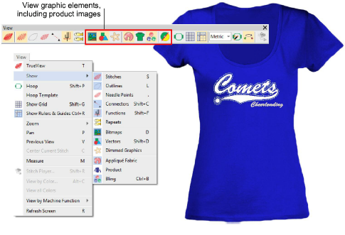
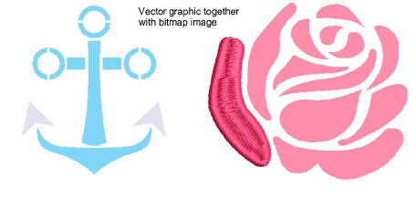
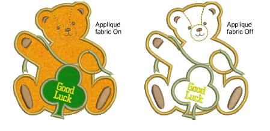
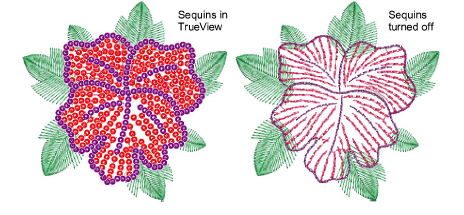
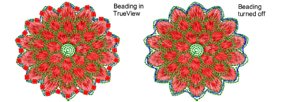

# View graphical components

Apart from embroidery, [EMB ](../../glossary/glossary)designs may include other components such as bitmap images, [vector graphics](../../glossary/glossary), appliqué fabrics, product backdrops, and rhinestones or ‘bling’. These can also be turned on or off as desired.

- Toggle the Show Bitmaps and/or Show Vectors icons to selectively view both vector and bitmap images.

- Click Dim Artwork to dim the onscreen image to view stitches more clearly when digitizing. The command applies both to bitmap and vector graphics.
- To lock an image in place, select and press K.
- Click the Show Appliqué Fabric icon to toggle display of appliqué fabric on/off.

- Use Show Bling to visualize any bling components present in a design.

- Use Show Functions to visualize any sequin components present in the design.

- Similarly, beading can be viewed while Show Functions is toggled on.

Tip: Depending on view options set in the Options dialog, images display in full color, or dimmed.

## Related topics...

- [Image viewing options](../../Setup/settings/Image_viewing_options)
- [Lock & unlock objects](../../Modifying/combine/Lock_unlock_objects)
- [View options](../../Setup/settings/View_options)
- [Bling Digitizing](../../Applied/bling/Bling_Digitizing)
- [Sequin Embroidery](../../Applied/sequin_basics/Sequin_Embroidery)
- [Bead Embroidery](../../Applied/beading/Bead_Embroidery)
- [Customizing design reports](../../Production/reports/Customizing_design_reports)
