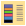
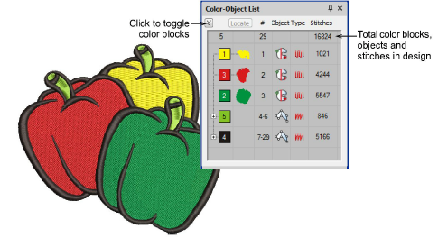
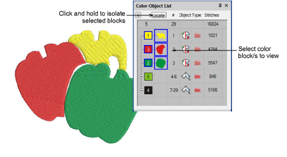
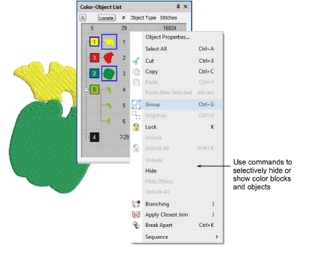
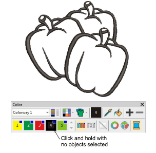
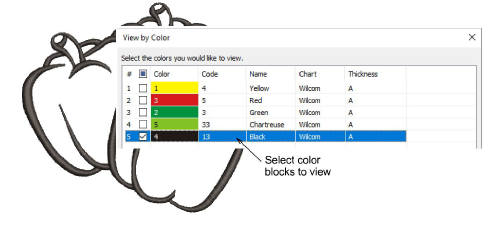
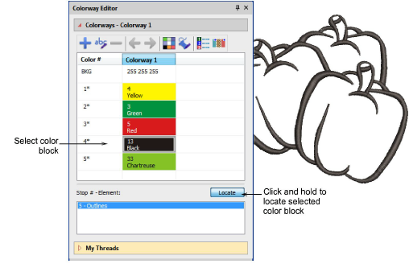

# View selected color blocks

|  | Use Docker > Color-Object List to toggle the Color-Object List display on and off. Use to view and sequence objects in a design. |
| ------------------------------------------------------------ | -------------------------------------------------------------------------------------------------------------------------------- |
|              | Use Color > Colorway Editor to assign thread colors to color blocks in the design.                                               |

A color block corresponds to a [color stop](../../glossary/glossary) in the design. It may contain a single object or group of like-objects – e.g. ‘ropes’. Or it may be comprised of different objects of like-color – e.g. ‘ropes and birds’. The Color-Object List offers an easy way to selectively view [color blocks](../../glossary/glossary) and embroidery objects. The View by Color function also lets you view objects by color. The Colorway Editor provides another method for selective viewing of color blocks.

## To view selected color blocks...

- Click the Color-Object List icon. The Color-Object List can be docked to the either side of the design window, or floated in any position.
- Click the switch to view the list by color block.

- Select a color block or blocks and click Locate and hold.

- Selectively hide or ‘unhide’ selected [color blocks](../../glossary/glossary) and [embroidery objects](../../glossary/glossary) using popup menu commands.

- Alternatively, to isolate a color block in the design window, click and hold it in the Color toolbar. First press Esc to deselect all objects.

- Alternatively, select View > View by Color. Select the colors you want to view. This function will not work with grouped objects.

- Alternatively, click the Colorway Editor. Select a color block and click Locate and hold.

- To reveal all hidden objects press Esc followed by press Shift+S or select View > View all Colors.

## Related topics...

- [Selecting objects](../basics/Selecting_objects)
- [Combining Objects](../../Modifying/combine/Combining_Objects)
- [Sequence by color](../../Modifying/combine/Sequence_by_color)
- [View selected color blocks](#XREF_22306_Selectively)
- [Name design elements](../../Digitizing/colorways/Name_design_elements)
