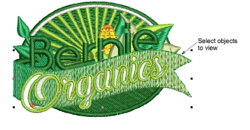
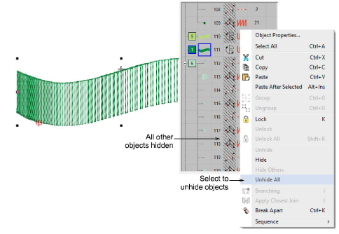
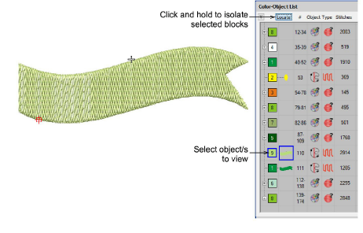
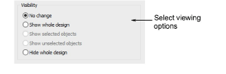

# View selected objects

|        | Use Select > Select Object to select individual objects as well as groups or ranges of objects.                                  |
| -------------------------------------------------- | -------------------------------------------------------------------------------------------------------------------------------- |
|  | Use Docker > Color-Object List to toggle the Color-Object List display on and off. Use to view and sequence objects in a design. |

EmbroideryStudio provides many techniques for hiding or showing selected [embroidery objects](../../glossary/glossary) in the design window.

## To view selected objects...

- Select the objects you want to view.

- Press Shift+S. All other objects are hidden. They can be revealed again via the Color-Object List popup menu.

- Alternatively, to temporarily hide other objects, select the object you want to view and click and hold the Locate button.

- To display the selected object full-screen, press Shift+0 (zero).
- To return to the previous view, select View > Previous View or press V.
- To re-display the entire design, press Esc followed by Shift+S.
- To redraw the screen, select View > Refresh Screen or press R.
- Optionally, select the Options icon in the Standard toolbar, or select Setup > Options > View Design tab, to toggle options for selective display of [embroidery objects](../../glossary/glossary):

Options include:

| Option                  | Function                                                                                   |
| ----------------------- | ------------------------------------------------------------------------------------------ |
| No change               | The display remains the same as before.                                                    |
| Show whole design       | All embroidery objects in the design are visible.                                          |
| Show selected objects   | Only objects that are currently selected are visible.                                      |
| Show unselected objects | The reverse of the above option. Only objects that are currently ‘unselected’ are visible. |
| Hide whole design       | All embroidery objects in the design are hidden.                                           |

## Related topics...

- [Selecting objects](../basics/Selecting_objects)
- [Selecting objects by color or stitch type](../../Modifying/combine/Selecting_objects_by_color_or_stitch_type)
- [Sequencing embroidery objects](../../Modifying/combine/Sequencing_embroidery_objects)
