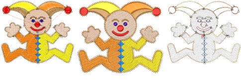

# Viewing Designs

EmbroideryStudio provides many viewing features to make it easier to work with your design. Use zoom and pan functions to study design details. Toggle between ‘artistic’ and ‘technical’ views. You can also preview designs in different colors on different fabrics by means of ‘[colorways](../../glossary/glossary#colorways)’.

EmbroideryStudio provides design information in various forms. Approval and production sheets provide essential information such as design previews, size, color sequence information and any special instructions.

## Related topics...

- [Viewing design components](Viewing_design_components)
- [Viewing objects & color blocks](Viewing_objects_color_blocks)
- [Viewing stitching sequence](Viewing_stitching_sequence)
- [Viewing colorways](Viewing_colorways)
- [Viewing design repeats](Viewing_design_repeats)
- [Viewing design information](Viewing_design_information)
