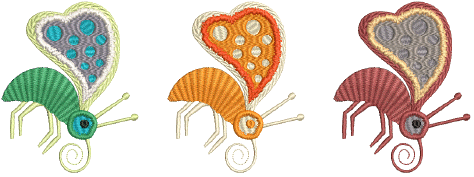

# Viewing colorways

A ‘colorway’ is a color scheme or palette of thread colors. It may also include a [background](../../glossary/glossary#background) color, fabric sample, or a product image. In EmbroideryStudio, you can define multiple [colorways](../../glossary/glossary#colorways) for the one design. This means you can stitch out the same design in different colors on different fabrics. You can also print multiple colorways, icons of [color blocks](../../glossary/glossary), and design backgrounds with the [production worksheet](../../glossary/glossary#production-worksheet).

## Related topics...

- [Switch colorways](Switch_colorways)
- [Change backgrounds](Change_backgrounds)
- [Change display colors](Change_display_colors)
