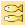
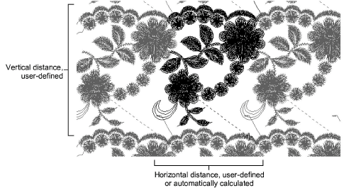
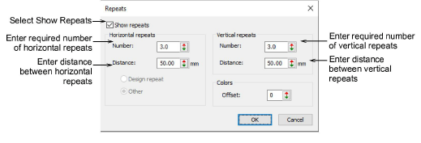
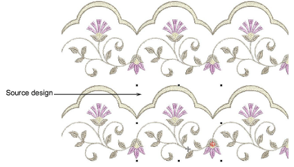

# Viewing design repeats

|  | Use View > Show Repeats to toggle design repeats display. Right-click for settings. |
| ------------------------------------------ | ----------------------------------------------------------------------------------- |

Many customers make traditional garments such as sarees which employ continuous and sometimes overlapping designs. It is important to be able to see these designs together with their repeats. The Show Repeats function displays repeating designs, including sequins, in both TrueView and stitch view. You can view a design, even while digitizing, with any number of repeats. The number can be a whole number or fractional.

Note: It is important that the artwork you use is properly sized and in the correct horizontal position. Always check the position of your artwork before starting to digitize.

## To view design repeats...

- Set your units of measurement as required.

Note: Stitch length and density controls remain in mm regardless of measurement system. These controls reflect the machine functions as industrial machines are always in millimeters.

- The first time you use the feature, right-click the Show Repeats tool or press shortcut W to access the Repeats dialog.

- Select the Show Repeats checkbox to activate the feature.
- Set the distance between horizontal repeats. This will always be expressed in millimeters. Depending on the template, different options are available:

| Option        | Function                                                                                                                                                                                                                                                          |
| ------------- | ----------------------------------------------------------------------------------------------------------------------------------------------------------------------------------------------------------------------------------------------------------------- |
| Design repeat | This option is only available with the Schiffli template. Repeat distance is fixed. This is typically a factor – x1, x2, x3, etc – of needle distance. See Schiffli Supplement for details.                                                                       |
| Other         | When selected, you need to manually enter a repeat distance in mm. This is typically used when doing continuous design work on multihead machines. The figure will generally correspond to the distance between machine heads – e.g. 135 mm – or factors thereof. |

- Enter the number of horizontal repeats. Repeats are balanced around the source design. This means that whole designs are displayed only for odd integer (1, 3, 5) numbers of repeats.

| Repeat | Effect                                                                                                                                                 |
| ------ | ------------------------------------------------------------------------------------------------------------------------------------------------------ |
| 1.0    | The original design only is displayed.                                                                                                                 |
| 1.2    | The original design is displayed, plus 0.1 of the design on either side of the original.                                                               |
| 2.0    | The original design is displayed, plus 0.5 of the design to either side of the original. The repeat pattern looks like this: \]\[\]\[.                 |
| 2.9    | The original design is displayed, plus 0.95 of the design to either side of the original.                                                              |
| 3.0    | the original design is displayed, plus a complete copy of the design to either side of the original. The repeat pattern looks like this: \[\]\[\]\[\]. |

- Vertical distance is not constrained by needle or head distance. Vertical distance will be a function of design height. Set vertical distance and number of repeats as preferred.
- To help distinguish the source design from repeat patterns, Use the Colors option to display repeats in different colors. Enter a color offset to indicate where you want to start the first repeat color. Let’s say you have a 4-color design using palette colors 1, 2, 3, 4\. If you set color offset to 5, repeat colors will display as 5, 6, 7, 8.
- Use the Show Repeats icon to toggle design repeats on or off.

## Related topics...

- [Preparing artwork for continuous embroidery](../../Automatic/bitmaps/Preparing_artwork_for_continuous_embroidery)
- [Set measurement units](../basics/Set_measurement_units)
