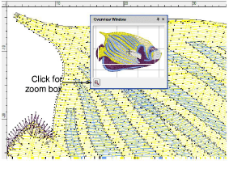
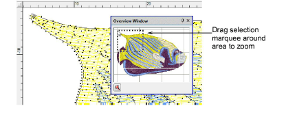
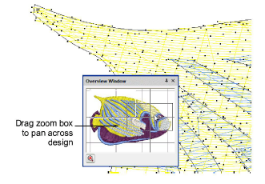
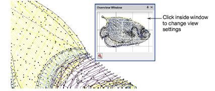

# Work with the Overview Window

|  | Use Docker > Overview Window to toggle window display on/off. Use it to view a thumbnail of the design. |
| ------------------------------------------------ | ------------------------------------------------------------------------------------------------------- |

Use the Overview Window to view a thumbnail of the design. Use it to pan and zoom the design when working at high zoom factors. Set view settings independently to the design window.

- To zoom in or out, click the Zoom button at the bottom of the window and drag a [selection marquee](../../glossary/glossary) around the area to zoom.

- To pan across the design, click and drag the zoom box.

- To change the view settings for the Overview Window, click it to make it the active window.

## Related topics...

- [View embroidery components](View_embroidery_components)
