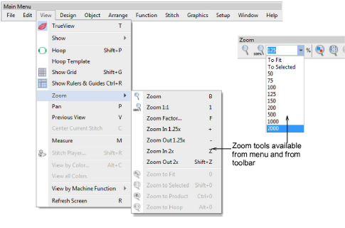
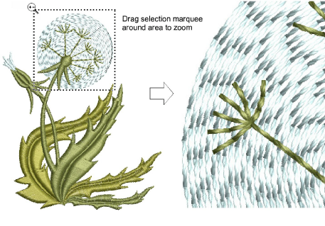
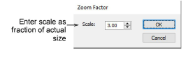
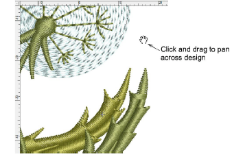

# Zoom & pan designs

|                      | Click Zoom > Zoom to invoke zoom mode. Zoom in or out via left and right mouse clicks, or drag a selection marquee to view design detail. |
| ------------------------------------------------ | ----------------------------------------------------------------------------------------------------------------------------------------- |
|                | Click Zoom > Zoom 1:1 to display a design at actual size.                                                                                 |
|            | Click Zoom > Zoom to Fit to display the whole design in the design window.                                                                |
|  | Click Zoom > Zoom to Selected to magnify only selected objects.                                                                           |
|          | Select Zoom > Zoom Factor from the droplist or key in a zoom factor and press Enter.                                                      |

Zoom tools allow you to magnify your view of the design by zooming in on individual stitches or details. The easiest way to zoom is via the mouse wheel. This defaults to 1.25x increments. The zoom factor can be adjusted in the Options > Scroll tab. Zoom tools are also available from the View menu and Zoom toolbar. Experiment with the available options.

Use shortcuts keys as indicated in the menus. For instance, to zoom in on a section of design, select View > Zoom or press B, and drag a marquee around the zoom area. To display the whole design, select View > Zoom to Fit or press 0.

- To display stitches at a particular scale, select a zoom scale from the droplist or key in a zoom factor and press Enter. Alternatively, select View > Zoom Factor (or press F). In the Zoom Factor dialog, enter a scale as a fraction of the actual size, where ‘1’ = ‘100%’, ‘1.5’ = ‘150%’, etc.

- To pan across a design, select View > Pan or press P and use the ‘grabbing hand’ tool.

## Related topics...

- [Scroll options](../../Setup/settings/Scroll_options)
