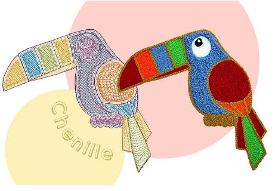

# Chenille Embroidery

EmbroideryStudio provides support for chenille digitizing with the dedicated Chenille add-on Element.

## Chenille basics

This chapter provides an overview of digitizing for chenille and visualizing chenille stitching. It also introduces chenille settings in EmbroideryStudio. It also covers handling chenille design files. [See Chenille Basics for details.](../chenille_basics/Chenille_Basics)

## Chenille digitizing

This chapter covers chenille input methods including creating compound chenille objects. It also covers creating chain-stitch fills, narrow chenille shapes, and borders. It also deals with needle heights. [See Chenille Digitizing for details.](../chenille_digitizing/Chenille_Digitizing)

## Chenille lettering

This chapter deals with chenille lettering. It covers scaling chenille lettering and using other fonts with chenille. [See Chenille Lettering for details.](../chenille_lettering/Chenille_Lettering)

## Chenille output

This chapter deals with chenille machine formats and settings. It also covers chenille machine files and chenille output. [See Chenille Output for details.](../chenille_output/Chenille_Output)

## Related video

<iframe width="560" height="315" src="https://www.youtube.com/embed/VoPmf_xPMPo" title="YouTube video player" frameborder="0" allow="accelerometer; autoplay; clipboard-write; encrypted-media; gyroscope; picture-in-picture" allowfullscreen></iframe>
