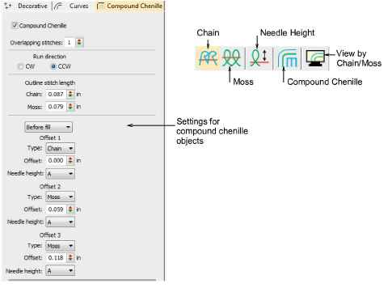

# Chenille Basics

In EmbroideryStudio, you use a single design workspace for both chenille and lockstitch embroidery. In addition, with the Chenille add-on activated, there is a dedicated Chenille template, a Chenille toolbar with chenille-specific stitch types and machine functions, dedicated chenille fonts, and a dedicated tab on the Object Properties docker.

EmbroideryStudio supports a wide range of chenille work and provides:

- Constant stitch length in all objects, for consistent smooth appearance
- Ability to control shortcut angles
- Variable width coil stitching
- Gaps at the ends of columns automatically filled with coil stitching
- Special ‘compound chenille’ objects which can include any kind of fill, with up to six offset borders in any combination of chain and moss stitching.

You should first become familiar with general EmbroideryStudio techniques before employing chenille-specific techniques. EmbroideryStudio has a certain design philosophy but once you understand it, similarities between individual functions become obvious. See the EmbroideryStudio Reference Manual for details.

## Related topics

- [Digitizing for chenille](Digitizing_for_chenille)
- [Chenille design parameters](Chenille_design_parameters)
- [Visualizing chenille stitching](Visualizing_chenille_stitching)
- [Handling chenille designs](Handling_chenille_designs)
