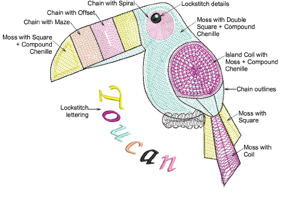

# Chenille fill patterns

Traditional chenille work usually involves a combination of two basic fill patterns – Square and Coil – in combination with chenille Moss. The pattern you use depends on input method as well as object shape, size and the effect you want to achieve.

Coil and Island Coil are traditional forms of chenille fill. They are both stitched in spirals. This fill type mimics hand-made chenille embroidery. Coil may be used to fill columns or narrow areas. Larger areas may be filled with Island Coil.

Alternatively, use Double Square to generate stitches on a grid rather than coils. Similarly, Square can be used for narrow shapes as an alternative to Coil. These fill patterns are generally better suited to squarish shapes with sharper angles.

Chain stitching is mainly used for outlines and more delicate work. It can, however, be used to create flatter fills. We recommend using open stitch patterns such as Maze Fill, Offset Fill, or Spiral Fill to create the kind of effect you see in the above sample.

## Related topics

- [Chenille patterns](../../Decorative/specialty/Chenille_patterns)
- [Chenille fill pattern usage](../chenille_digitizing/Chenille_fill_pattern_usage)
- [Maze fills](../../Decorative/specialty/Maze_fills)
- [Offset fills](../../Decorative/curves/Offset_fills)
- [Spiral fills](../../Decorative/curves/Spiral_fills)
