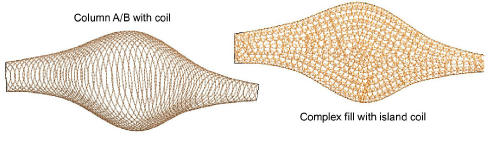

# Chenille input methods

|  | Use Traditional Digitizing > Complex Fill to digitize filled shapes with a single stitch angle. Right-click for settings.                                      |
| ------------------------------------------ | -------------------------------------------------------------------------------------------------------------------------------------------------------------- |
|            | Use Traditional Digitizing > Column A to create columns of varying width and stitch angle. Right-click for settings.                                           |
|            | Use Traditional Digitizing > Column B to create asymmetrical columns of turning stitches, where opposite sides are different shapes. Right-click for settings. |
|            | Use Traditional Digitizing > Column C to digitize columns or borders of fixed width. Right-click for settings.                                                 |
|        | Use Traditional Digitizing > Digitize Run to create row of single stitches along a digitized line.                                                             |

You can digitize chenille objects manually using practically any input method, including Freehand. But the main methods are summarized above. Stitch angles have limited effect on chenille embroidery.

## Tips for use

- Typically chenille objects are digitized with Complex Fill in conjunction with Compound Chenille. Resulting objects include borders to contain chenille fills and provide edge definition. This is important when using Moss.
- Compound Chenille objects will only work with two basic stitch patterns – Square and Coil. Moss stitch is generally applied to these fills.
- Chain has limited applicability to coil or double-square fill patterns.
- Complex Fill cannot be used with Coil and will default instead to Island Coil as shown above.
- Variable-width Coil stitching can only be created with Column A or Column B input methods.
- Column C can be used to create columns of constant width.
- Column methods cannot be used with Compound Chenille.
- Moss objects created with these input methods will require chain borders. These need to be added manually. This in turn makes scaling more problematic as gaps between borders and fills will change.
- While variable width coil looks artistic on screen, it won’t look like this on stitchout. Moss stitching is very dense and covers the fabric entirely. Variable-width Coil patterns may be better employed with lockstitch embroidery.

## Related topics

- [Start a new chenille design](Start_a_new_chenille_design)
- [Digitizing Shapes](../../Digitizing/input/Digitizing_Shapes)
- [Chenille Digitizing](../chenille_digitizing/Chenille_Digitizing)
