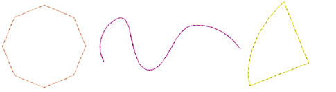

# Chenille runs & borders

While borders are built into Compound Chenille objects and can therefore be scaled with the object, you can also digitize single-line borders manually. For this, you typically use Digitize Run with Chain stitching. One or two offset run-arounds provide a clear edge for filled areas and help to secure chenille fill stitching. Other input methods can be used. If your machine supports it, you may combine chenille with regular stitching to tie-off chenille objects.

## Related topics

- [Creating chenille borders](../chenille_digitizing/Creating_chenille_borders)
