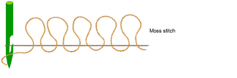
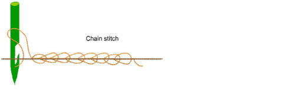

# Chenille stitch types

To qualify as a ‘chenille object’, a digitized shape must have Chain or Moss applying. These are the two basic stitch types created by all chenille embroidery machines. In EmbroideryStudio, they are added as machine functions which can be interpreted only by dedicated chenille or combination machines. As such, they cannot be displayed in TrueView.

## Moss stitch

|  | Use Chenille > Moss to create dense cover using looped stitch typical of chenille raised stitching – best with simple shapes. Right-click for settings. |
| ---------------------------- | ------------------------------------------------------------------------------------------------------------------------------------------------------- |

Chenille Moss produces the typical raised stitching associated with chenille work. It can only be applied to two basic fill patterns – Square and Coil. It can be stitched at different needle heights – lower for outlines and higher for fill. It works best with simple shapes.

Chenille has no bobbin thread. Without tie-ins and tie-offs, Moss stitch can loosen during washing. For this reason, Chain borders are used to achieve a tie-in and tie-off effect.

::: tip
A sticky fabric can also be used to back Chenille embroidery using a heat and press method. Using this production process, moss fill does not require a chain border.
:::

## Chain stitch

|  | Use Chenille > Chain for decorative stitching resembling links of a chain. Can be used as a delicate fill or as a border for moss fills. Right-click to adjust settings. |
| ------------------------------ | ------------------------------------------------------------------------------------------------------------------------------------------------------------------------ |

Chenille Chain produces a decorative style of stitching resembling the links of a chain. It is used for outlining and bordering designs as well as monograms. Chain can also be used for more delicate detailing or fills.

Compound Chenille objects generally include built-in offset chain borders. Alternatively, chain borders can be digitized separately, usually with Run input method. Chain fills can be created in conjunction with other, non-chenille, stitch patterns.

::: tip
In conjunction with chain stitching, a chenille design typically builds in height from the edges to the middle.
:::
