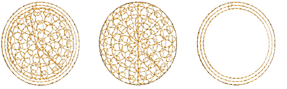

# Compound chenille

|  | Use Chenille > Compound Chenille to automatically digitize chenille shapes with offset borders. Right-click to adjust automatic offset borders. |
| ---------------------------------------------------- | ----------------------------------------------------------------------------------------------------------------------------------------------- |

Chenille objects generally include a border to contain chenille fill stitching and provide edge definition. One or two offset run-arounds are usually sufficient to provide a clear edge and secure fill stitches. The Compound Chenille tool allows up to three (1-3) borders to be generated both before and after the fill. When a compound object is scaled, borders are included.

::: info Note
Compound Chenille objects will only work with two basic stitch patterns – Square and Coil, single or double. Moss stitch is generally applied. Chain has little applicability to these fill patterns.
:::

## Related topics

- [Create compound chenille objects](../chenille_digitizing/Create_compound_chenille_objects)
- [Compound chenille settings](../chenille_digitizing/Compound_chenille_settings)
