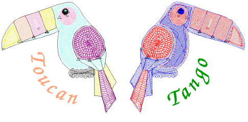

# Digitizing for chenille

You digitize chenille objects using regular input methods – traditional and graphical. Chenille work involves only two stitch types – Chain and Moss. Moss is generally used for fills, Chain for borders or details. Chain may also be used for flatter fills.

Chenille usually involves a combination of two basic fill patterns – Square and Coil, single or double. Use these stitch patterns together with Moss for chenille fills. Run stitch is typically used with Chain for borders. For chenille, you mainly use Compound Chenille with Complex Fill to digitize objects – even narrow ones – with built-in chain borders.

## Related topics

- [Chenille stitch types](Chenille_stitch_types)
- [Chenille fill patterns](Chenille_fill_patterns)
- [Chenille input methods](Chenille_input_methods)
- [Compound chenille](Compound_chenille)
- [Chenille runs & borders](Chenille_runs_borders)
